# Lyve Cloud Bucket Metrics Collection - using AWS Lambda

## Introduction
The purpose of this solution is to showcase how Lyve Cloud bucket metrics can be securely pulled by hyperscalers(AWS) using their native services such as Lambda. Once the metrics are pulled it can be displayed using AWS CloudWatch dashboards. A sample dashboard is also provided as part of this solution for reference. This is by no means a complete solution that can be used in a production environment.

## Requirements
Before you start, please make sure you have these requirements and information in place:
- Lyve Cloud account
- Access to Lyve Cloud console to create/modify the following services:
	- Buckets
	- Permissions
	- Service Account
- Lyve Cloud access and secret key. These can be obtained from the console by creating a new Service Account with appropriate permissions.
- AWS account
- Access to AWS Management Console with necessary permissions to create/modify the following services:
	- IAM
	- Lambda
	- Secrets Manager
	- CloudWatch
	- Event Bridge

## Known Limitations
This repository provides a sample code to show how to configure, schedule and pull metrics from Lyve Cloud into AWS CloudWatch, but it’s by no means a complete solution. There are limitations and functionality gaps to handle before this sample code can be used in a production environment:
- The sample code only pulls newly generated metric from Lyve Cloud once every 6 hours (duration can be modified as desired). Please note, metrics from past will not be pulled into AWS CloudWatch.
- Error capturing and reporting is limited, some failures may not be reported.

**Note:** For this sample code, full access permissions are provided. However, for using his solution in a production environment a principle of least privilege model should be adopted.

## Setup Instructions
### Step 1: Get Lyve Cloud credentials and endpoints
Login to Lyve Cloud console, create a Service Account with appropriate permissions and extract the following:
	* Access Key
	* Secret key
	* Endpoint URL


### Step 2: Store Lyve Cloud credentials securely in AWS
1. Login to AWS Management console and go over to Secrets Manager
2. Click `Store a new secret`
3. Choose `Other type of secret` for Secret type
4. Under Key/value pairs, create key/value pairs for the following:

	* Key: lc_access_key, Value: [Access key from step 1]
	* Key: lc_secret_key, Value: [Secret key from step 1]
	* Key: lc_endpoint_url, Value: [Endpoint URL including https:// from step 1]

	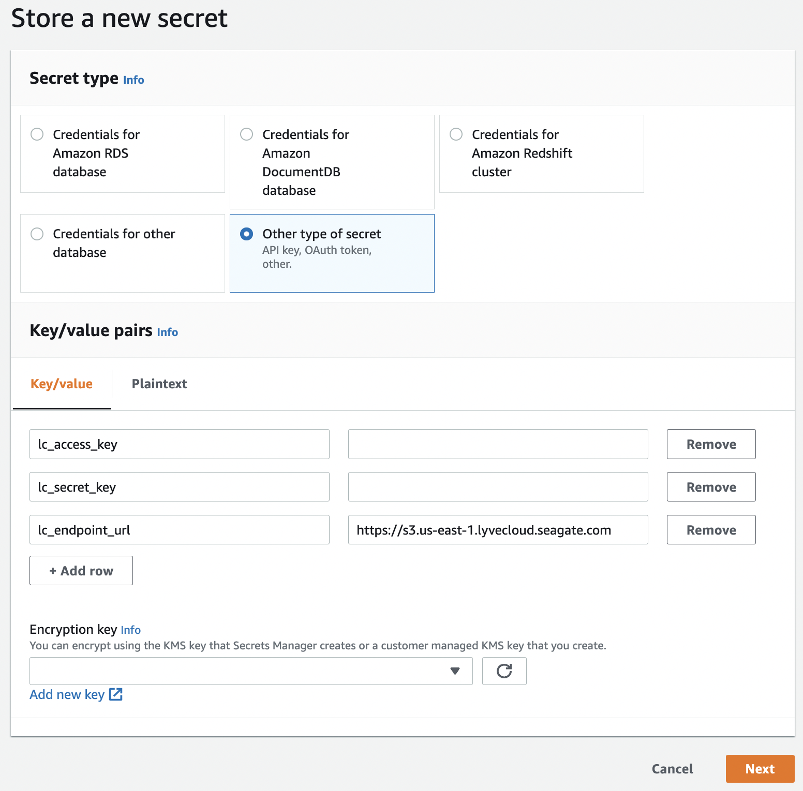

5. Click `Next`
6. Enter `Secret name` and make a note of it as you will need it during Lambda function creation. Rest of the field, you can leave it as default.

	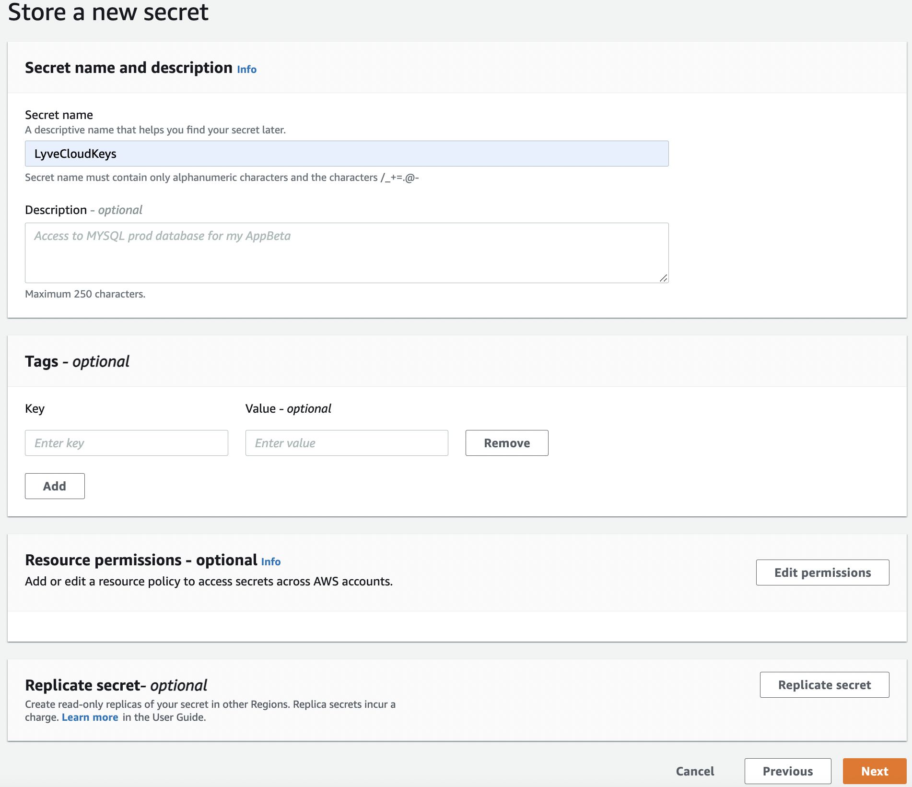

7. Click `Next`
8. No need to set Secret rotation for this sample, so you can leave them to default
9. Click `Next`
10. Review the summary and Click `Store`
11. Once created, you will see them under Secrets

	


### Step 3: Create IAM policy for Lambda function
1. In the AWS Management Console go over to IAM.
2. Under Access Management, Click `Roles`
3. Click `Create role`
4. Choose `AWS service` for Trusted entity type
5. Choose `Lambda` for Use case

	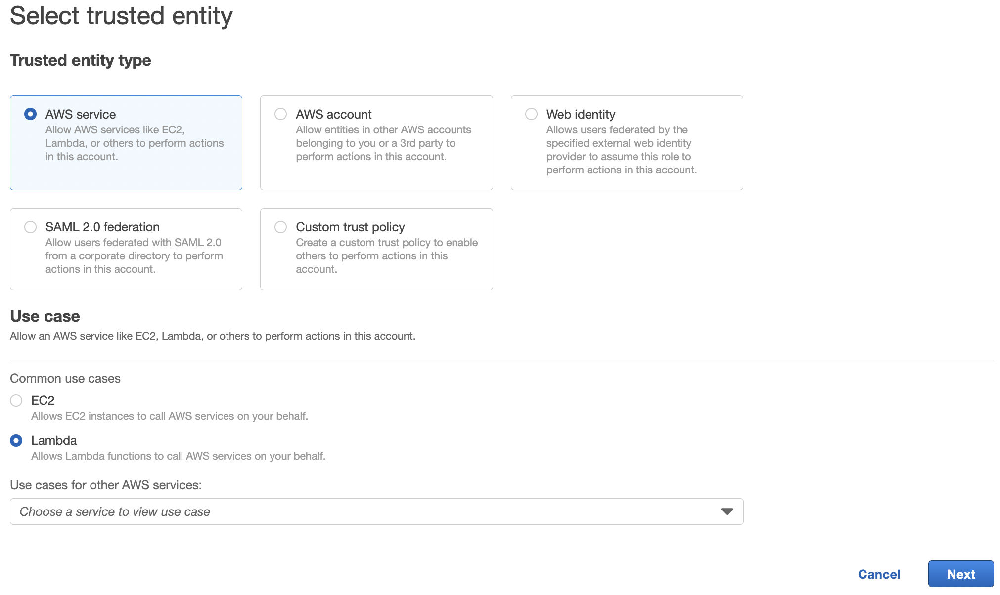

6. Click `Next`
7. Choose the following `Permissions policies`
	* `AWSLambdaBasicExecutionRole`
	* `CloudWatchFullAccess`
	* `SecretsManagerReadWrite`
8. Click `Next`
9. Enter `Role name`, verify permissions and Click `Create role`

	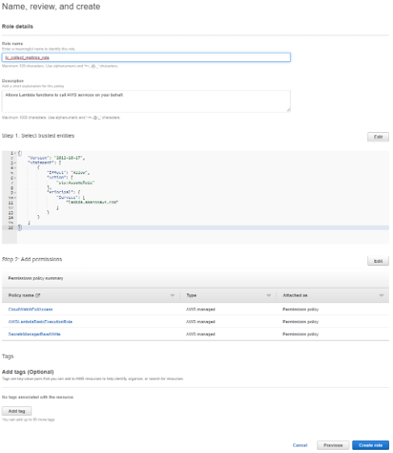

10. Make a note of the Role name as you will need it during Lambda creation

	

 
### Step 4: Create Lambda function
1. In the AWS Management console go over to Lambda
2. Click `Create function`
3. Choose option `Author from scratch`

	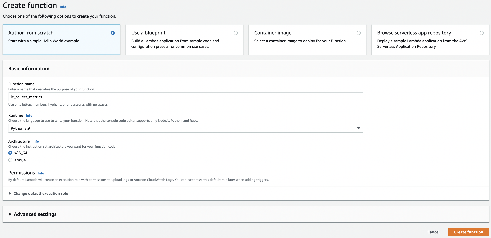

4. Enter `Function name` and choose `Python 3.9` for Runtime

	

5. Choose `Use an existing role` and pick the role created earlier from the drop-down list

	

6. Click `Create function`
7. Open the Lambda function
8. Copy and Paste the contents of lambda_function.py into the Code source section
9. Click `Deploy`

	

10. Ensure the Handler is set `lambda_function.lambda_handler`

	

11. Go over to the tab `Configuration`
12. Edit `General configuration` and set Timeout to at least 10 secs

	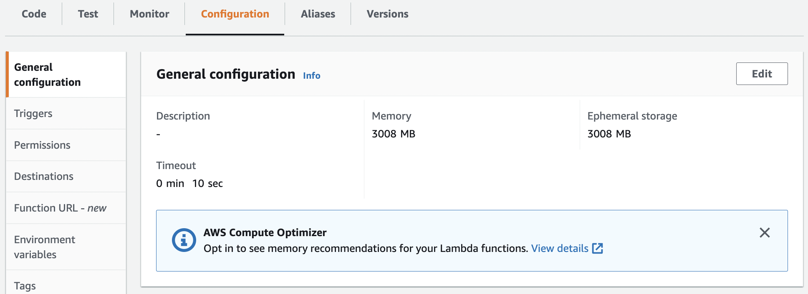

13. Edit `Environment variables` to add the following Key/Value pairs
	* Key: REGION, Value: `us-west-1`
	* Key: SECRET_KEY, Value: `LyveCloudKeys` – Secret name created earlier

	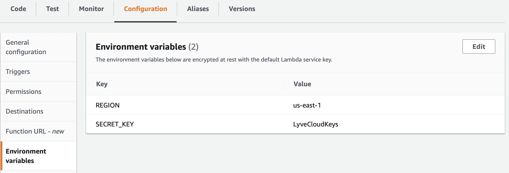

14. Go over to the tab `Test`
15. Click `Test` after creating a new event using default Event JSON

	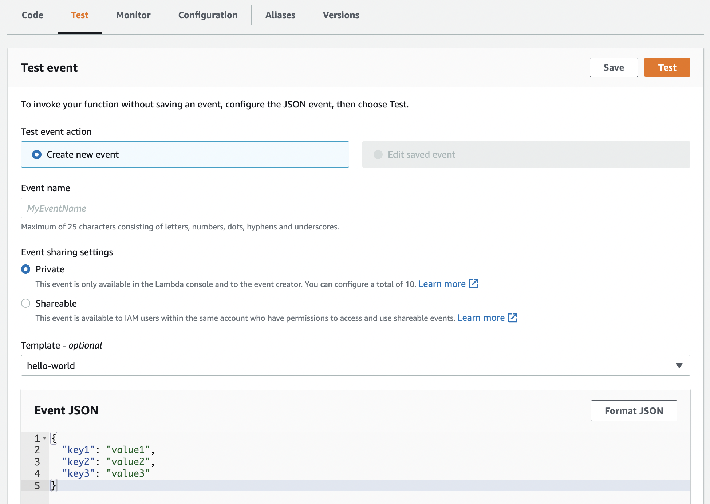

16. Click `Test`

	

17. If `Test` returns error, expand Details or check `logs` to see the errors


### Step 5: Create Event Bridge to schedule Lambda function
1. In the AWS Management console go over to Amazon Event Bridge
2. Click `Rules` under `Events`
3. Click `Create rule`
4. Enter a name and choose `Schedule` under Rule detail

	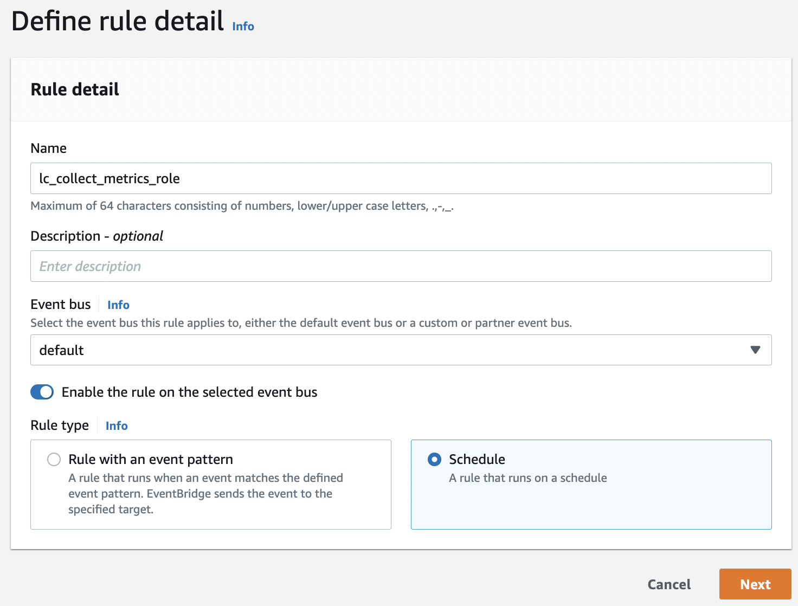

5. Click `Next`
6. Choose your desired Schedule pattern

	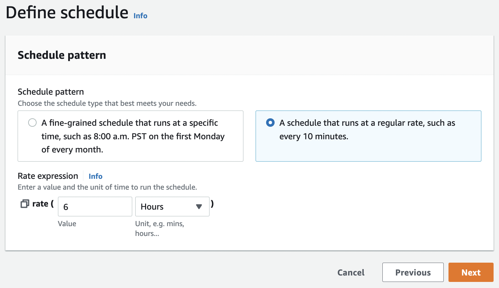

7. Click `Next`
8. Choose `AWS Service` `Lambda function` and the Function created earlier as Target 1

	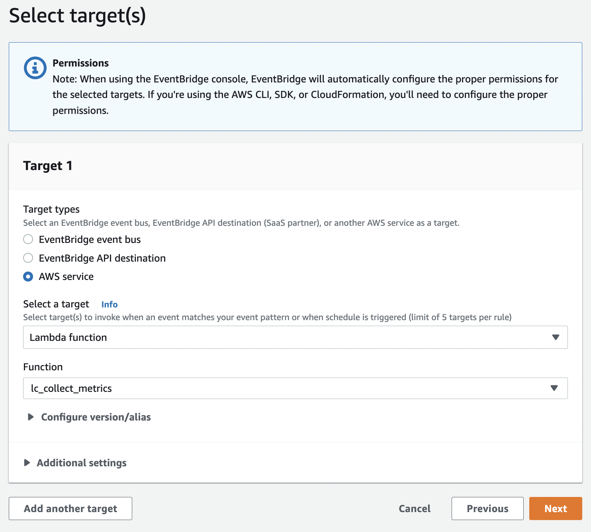

9. Click `Next`
10. Click `Next` – Tags
11. Under `Review and create` click `Create rule`
12. Once successfully created, it should show under Rules as follows:

	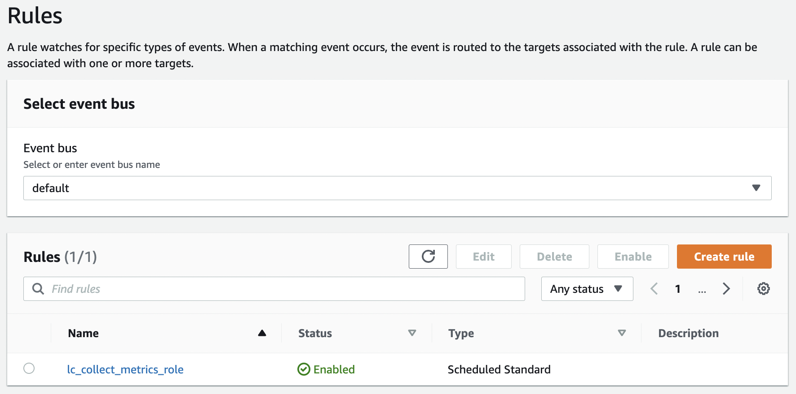


### Step 6: Create Cloud Watch dashboard
1. In the AWS Management console go over to CloudWatch.

**Important:** Make sure the region you are on is the desired one.

2. Select `Dashboards`.
3. Click `Create dashboard`.
4. Enter a name and click `Create dashboard`

	

5. A popup (Add widget) will appear, choose your desired widget
6. On next screen popup, Choose `Metrics`

	

7. Choose `LyveCloudBucketSizes` from the Custom namespaces

	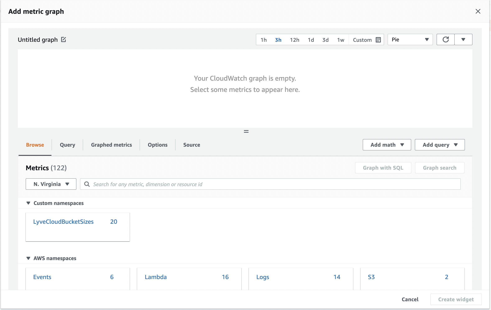

8. Choose desired metrics and click `Create widget`

	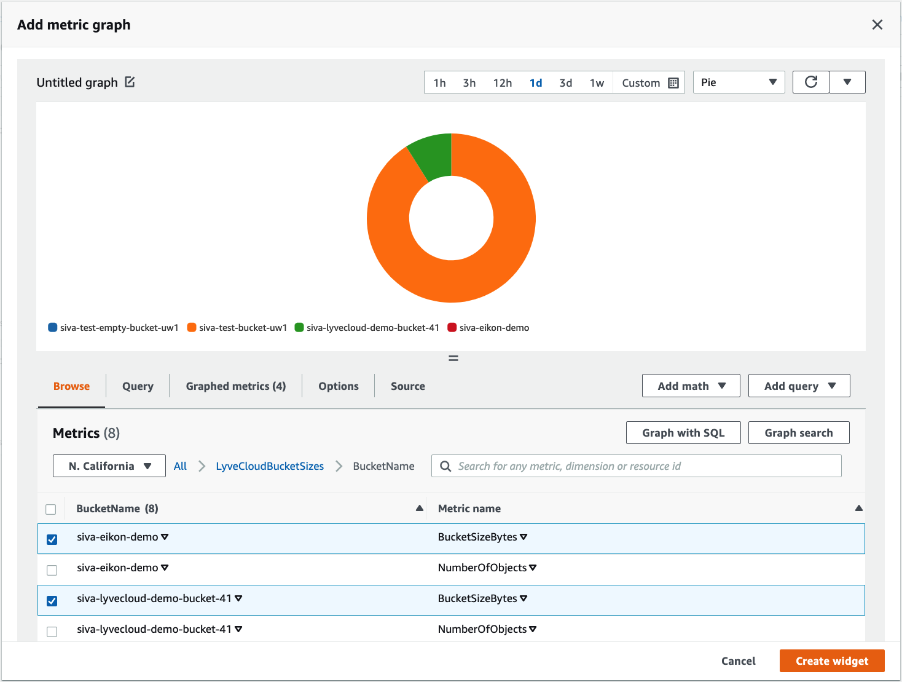

9. Add more widgets if you desire and click `Save dashboard`

	

10. Once successfully saved, you should see it under Custom dashboards as follows:

	


## Architecture Diagram
Given below is the overall architecture diagram of this solution:

	


## Results 
After a successful implementation you should see a similar dashboard as follows:

	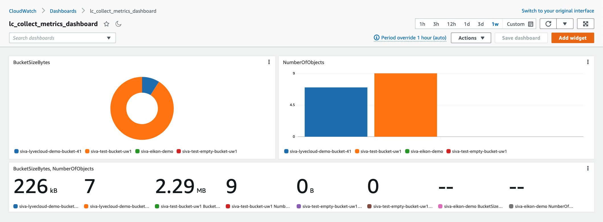


### Project Structure

This section will describe the representation of each of the folders or files in the structure.
```
.
├── README.md
├── cloudwatch-dashboards
│   └── sample-dashboard.json
│   └── sample-dashboard-2.json
├── images
│   └── <Collection of .png files>
├── lambda-functions
│   └── collect_metrics.py
└── .gitignore
```

### `/cloudwatch-dashboards`
This folder contains samples of dashboards that can be imported to CloudWatch.

### `/images`
Contains images for the documentation.

### `/lambda-functions`
This folder contains the lambda functions that are used to pull lyve cloud bucket metrics.

